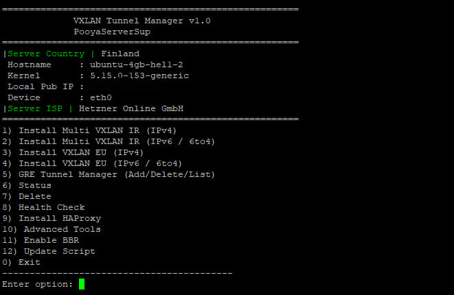

<h1 align="center">⚡️ Welcome to VXLAN Manager ⚡️</h1>

** Multi VXLAN over UDP Manager (IPv4 & IPv6) **

> **Disclaimer:** This tool configures **point-to-point VXLAN tunnels** over UDP.  
> It supports **IPv4 (/30)** and **IPv6 (/64)** addressing, and uses **systemd services** with built-in **health-check** for persistence.  

**We don't need financial support, only a Star (⭐) is enough, thank you.**

---

## 🚀 Features

- Multi VXLAN **IR Side**: up to **10 simultaneous tunnels** to EU peers  
- VXLAN **EU Side**: single-tunnel setup (IPv4 or IPv6)  
- Supports both **IPv4** and **IPv6 (6to4)** tunnels  
- Auto-detects local device and public IP  
- Config persistence in `/etc/vxlan-manager.conf`  
- **systemd services** for auto-start  
- **Health-check timer** to keep tunnels stable  
- Extra option to **install HAProxy** (via external script)  

---

## 📦 Install & Upgrade

```
bash <(curl -Ls https://raw.githubusercontent.com/Ramin-Setoodehnia/VXLAN-Tunnel/master/main.sh)
```

## Languages

- English

## 🪚 Preview
<p align="left">
  
</p>

